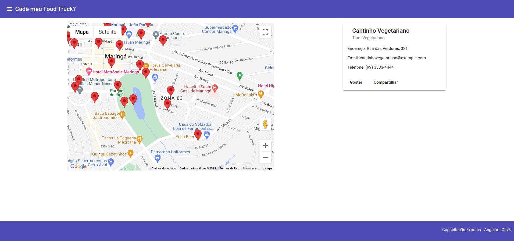
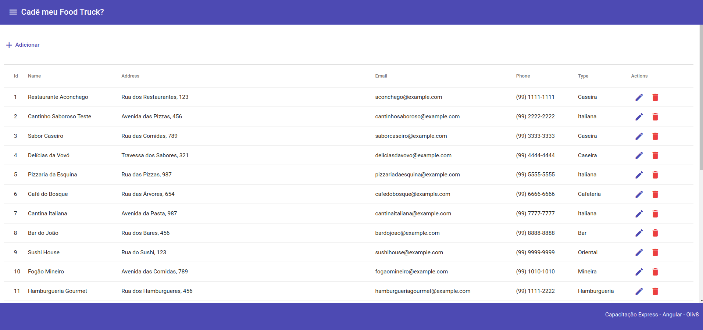
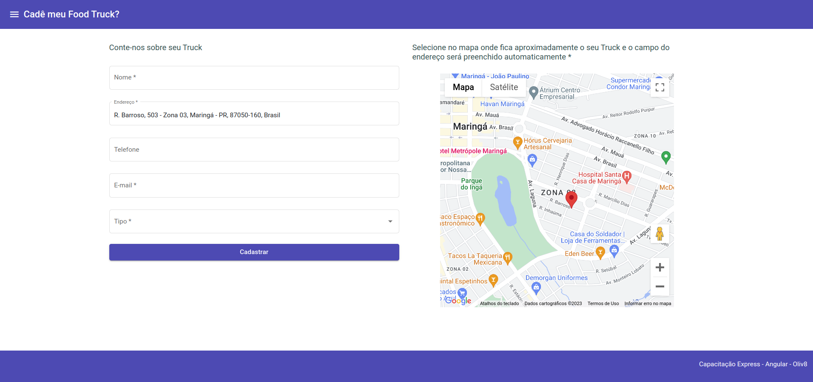

# CadeMeuFoodTruck

This project was generated with [Angular CLI](https://github.com/angular/angular-cli) version 14.2.6.

## Backend

This project uses [Json Server](https://github.com/typicode/json-server).

## How to run

Enter a valid Google key for Google Maps to work:

**environments.ts** file: `googleMapsKey='YOUR_KEY'`

Run this command to install this project's dependencies:

```bash
CadeMeuFoodTruck$ npm install
```

Run the following command to start json-server and angular project:

```bash
CadeMeuFoodTruck$ npm start
```

## How to works

When starting the project, the map will be focused on a region that contains some fictional trucks, where you can select them and view information such as `name`, `address`, `phone`, `email`, and `type`.



In the top-left corner of the side menu, there is an option called `Trucks` that navigates the website to a page with all registered trucks, where you can **add**, **edit**, and **delete** records.



Clicking on `Adicionar` or editing (using the pencil icon) will navigate the website to a page where the operation can be performed. To make it easier, when clicking on a location on the map, the website will automatically populate the `address` field with the address retrieved from **Google Maps**.



This is it!
